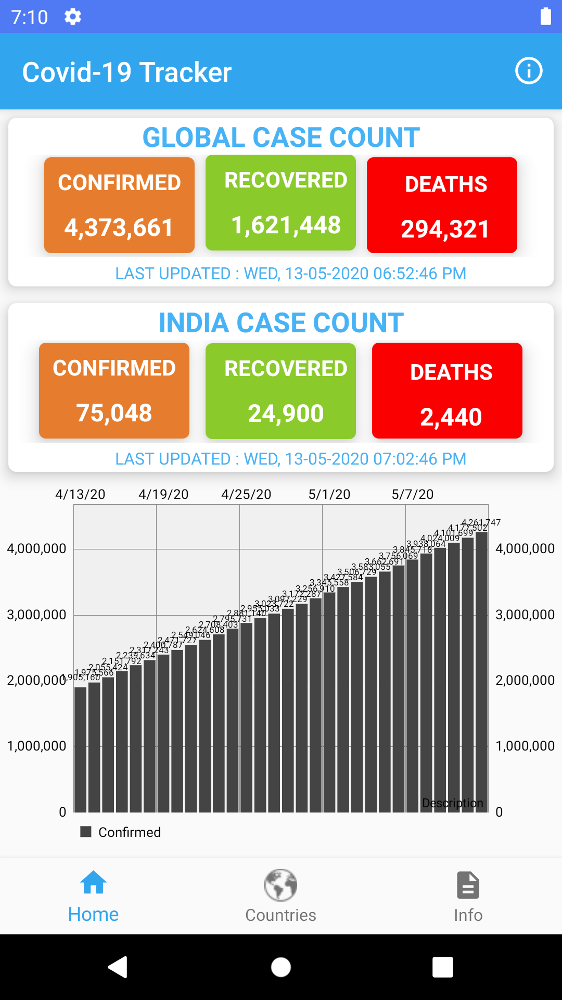

# Covid_19_Tracker
Covid-19 Tracker is an Android app to track the corona status of each country.
It show confirmed cases, recovered cases, deaths and active cases Data country wise 
Show Statistical data chart of each country 

        
        </img>
        </img>
        </img>

## **Data Source**
The data is collected from the following api's.

* NovelCovidApi :https://corona.lmao.ninja/docs/#/
* Covid19India : https://www.covid19india.org
